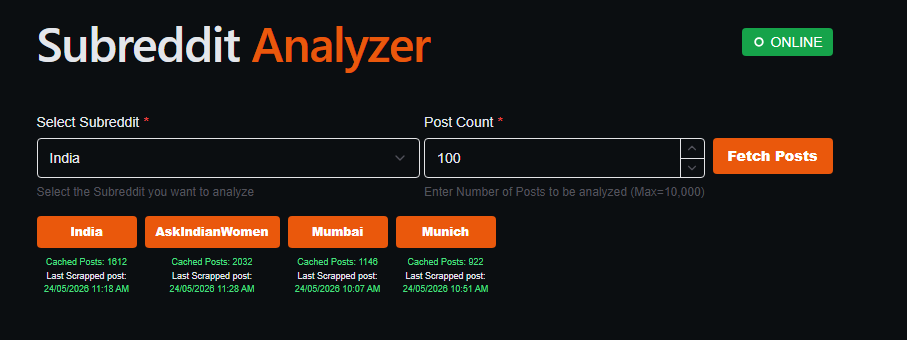
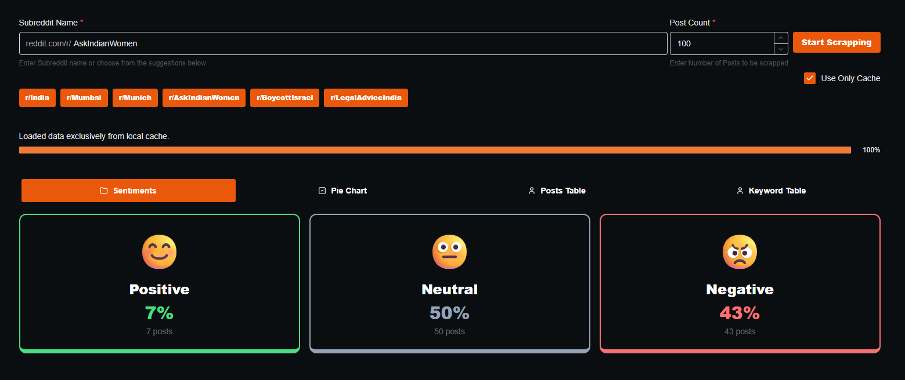
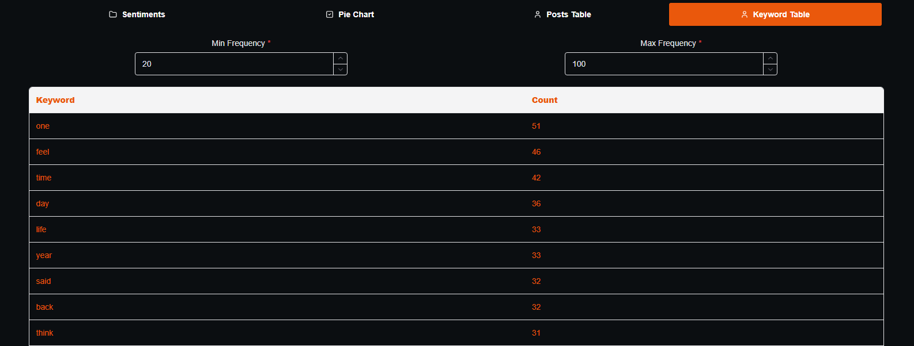
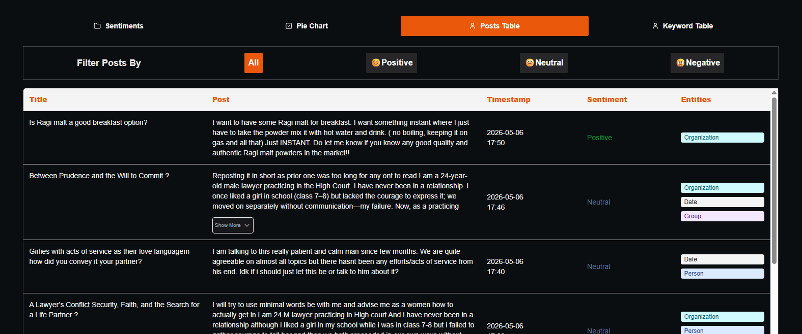
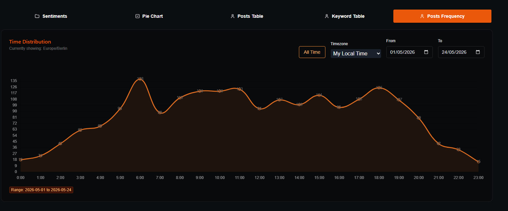

# Reddit Data Scrapper

A full-stack Reddit analysis platform that combines a React dashboard with a Python FastAPI backend, NLP pipelines, and PostgreSQL-backed storage.

## Live Demo

Access the live deployment at:

- https://subanalyzer.theonlyalfaz.com/


## What the Project Does

This project is built to discover and analyze Reddit data with a full-stack platform that combines scraping, database storage, NLP, and dashboard visualization.

- #### Subreddit selection and post count input with Cache summary display of tracked subreddit statistics
   

- Sentiment analysis views
   

- Keyword frequency and pie chart visualization
  

- Posts table with sortable/filterable results
   

- Post frequency analytics
  

<!-- - Dynamic reanalysis UI panel
  -  -->

## Project Overview

This repository contains:

- `src/`: React frontend application built with Vite and Chakra UI.
- `Scrapping/`: Python backend, data scraper, NLP processors, database modules, and FastAPI routing.
- `Scrapping/requirements.txt`: Python dependencies.
- `package.json`: frontend dependencies.

The application allows a user to select a subreddit, request a number of posts, and view analysis across sentiment, keywords, entities, and post frequency.

## Architecture

### Frontend

- React 19
- Vite
- Chakra UI
- Redux Toolkit
- Chart.js / react-chartjs-2
- Firebase
- Recharts
- PapaParse

### Backend

- Python 3
- FastAPI
- Uvicorn
- Playwright
- Transformers
- PyTorch
- spaCy
- NLTK
- PostgreSQL via `asyncpg`

### Database

<!-- - PostgreSQL connection configuration is in `Scrapping/config.py` -->
- Tables and storage are managed by `Scrapping/database/`
- Post, subreddit, ignored words, and queue state are handled by async DB helpers

## Backend API Endpoints

### Subreddits

- `POST /subreddits` #PendingFeature
  - body: `{ name, description?, total_users?, is_active?, keep_updated? }`
  - Creates a new tracked subreddit configuration.
- `GET /subreddits`
  - Returns tracked subreddit entries.
- `GET /subreddits/{name}`
  - Returns details for one tracked subreddit.
- `PUT /subreddits/{name}`
  - Updates a subreddit tracking configuration.
- `DELETE /subreddits/{name}`
  - Removes a subreddit from active tracking.

### Posts

- `GET /summary`
  - Returns cached summary data for all tracked subreddits.
- `GET /posts/{subreddit}?limit={n}`
  - Returns up to `n` posts for the requested subreddit.
- `GET /posts/{subreddit}/all`
  - Returns all cached posts for the requested subreddit.

### Real-time Reanalysis 

- `WS /ws/reanalyze` #Hidden
  - WebSocket endpoint that receives actions such as:
    - `start`
    - `pause`
    - `resume`
    - `stop`
  - Allows live progress updates for NLP reanalysis work.

## Important Backend Behavior

- `Scrapping/main_v2.py` starts the FastAPI app and a long-running background worker.
- The background worker:
  - loads active subreddits
  - performs queue maintenance
  - boots up missing subreddit caches
  - performs routine updates if data gaps exist
- `Scrapping/routes_reanalyze.py` supports live reanalysis over WebSocket.
- `Scrapping/Routes/routes_posts.py` and `Scrapping/Routes/routes_subreddits.py` expose REST endpoints.

## Installation

### 1. Backend

```bash
cd "d:\React JS\Reddit-Data-Scrapper\Scrapping"
python -m venv .venv
# Activate the venv on PowerShell
.\.venv\Scripts\Activate.ps1
pip install -r requirements.txt
python -m spacy download en_core_web_sm
python -m playwright install
```

> If your system uses a different browser executable, update the scraping setup accordingly.

### 2. Frontend

```bash
cd "d:\React JS\Reddit-Data-Scrapper"
npm install
```

## Running Locally

### Start the backend

```bash
cd "d:\React JS\Reddit-Data-Scrapper\Scrapping"
python main_v2.py
```

The backend listens on `http://192.168.0.246:8000` in development mode.

### Start the frontend

```bash
cd "d:\React JS\Reddit-Data-Scrapper"
npm run dev
```

### Notes

- The frontend uses `BASE_URL` values in `src/App.jsx` and `src/components/ui/ReanalyzeButton.jsx`.
- Adjust the hard-coded host if your backend runs on a different address.
- `Scrapping/config.py` controls database settings, `MAX_CONCURRENT_TABS`, and scrape interval.

## Frontend Usage

1. Open the React app in the browser.
2. Select a subreddit from the cached summary dropdown.
3. Enter the number of posts to fetch.
4. Click **Fetch Posts**.
5. Explore sentiment, keyword, table, and frequency tabs.
6. Use the reanalysis UI to trigger dynamic NLP pipelines if available.

## Project Structure

- `src/` — React app source
- `src/components/ui/` — dashboard UI components
- `src/components/Data/` — chart and table components
- `Scrapping/` — backend app, scraper logic, NLP, database helpers
- `Scrapping/Routes/` — FastAPI route modules
- `Scrapping/database/` — PostgreSQL access and persistence logic

## Screenshots / Media

<!-- Add screenshots here if available: UI dashboard, charts, tables, analytics panels -->

## Dependencies

### Python (backend)
- `asyncpg`
- `playwright`
- `transformers`
- `torch`
- `uvicorn`
- `fastapi`
- `nltk`
- `spacy`
- `collections-extended`
- `pytest`
- `pytest-asyncio`

### JavaScript (frontend)
- `react`
- `react-dom`
- `@chakra-ui/react`
- `@chakra-ui/charts`
- `@reduxjs/toolkit`
- `@tanstack/react-table`
- `chart.js`
- `chartjs-plugin-datalabels`
- `firebase`
- `next-themes`
- `papaparse`
- `react-chartjs-2`
- `react-icons`
- `react-redux`
- `recharts`

## Notes

- `Scrapping/auth.json` may contain browser auth/session data and should be managed carefully.
- The repository uses `FastAPI` for the backend API and WebSocket management.
- The frontend includes a hidden reanalysis section powered by WebSocket controls.

## License
This repository is intended for learning, experimentation, and personal analytics. Modify as needed for your own deployment or research use case.